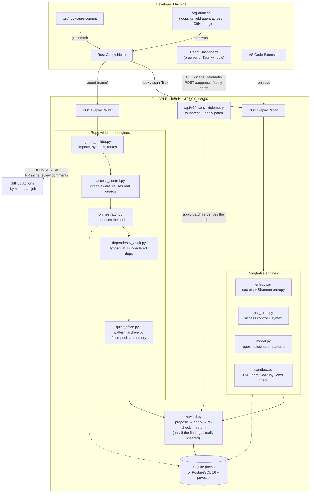

# KShield — System Architecture

_This document always reflects the current architecture. Prior versions are kept as separate files, not sections — see [architecture-v1.md](architecture-v1.md) for the pre-audit-engine snapshot (v1.1.0 and earlier). When the architecture changes again, save the current content of this file as `architecture-v<N>.md` before editing it, and link the new snapshot from here._

## Overview

KShield is a **local-first** security analysis system. All code scanning, pattern matching, and remediation generation happen on the developer's machine. No source code is transmitted to external servers, and no LLM or external model is called at any point — every finding and every patch is produced by local regex/AST/graph logic.

Five entry points:
- **`kshield init`** — one-time setup per repo: installs hook, downloads backend, starts it
- **Rust CLI, single-file path** — `hook` (every `git commit`) and `scan <file>` block CRITICAL/HIGH findings for one file
- **Rust CLI, repo-wide path** — `agent <name>` audits every git-tracked file in one pass, graph-aware; `org-audit.sh` chains this across a whole GitHub org
- **React Dashboard** — real-time telemetry UI, optionally wrapped in a Tauri native window
- **VS Code Extension** — inline diagnostics as you type, talking to the same local backend

---

## Architecture Diagram (v2)

_Reflects `dev` as of 2026-07-19 — CHANGELOG **[Unreleased]** (post-1.1.0), covering the repo-wide audit engine and the `ksword` remediation agent. For the pre-audit-engine system, see [architecture-v1.md](architecture-v1.md)._



---

## Full System Diagram

```
╔═══════════════════════════════════════════════════════════════════════════╗
║                          DEVELOPER MACHINE                                ║
╠═══════════════════════════════════════════════════════════════════════════╣
║                                                                           ║
║  Developer runs:  kshield init   (once per repo)                         ║
║       │                                                                   ║
║       ▼                                                                   ║
║  ┌─────────────────────────────────────────────────────────────────────┐ ║
║  │                    Rust CLI  (kshield binary)                         │ ║
║  │                                                                       │ ║
║  │  Commands                        Lifecycle                           │ ║
║  │  · init   → setup + hook          · setup.rs downloads backend       │ ║
║  │  · hook   → pre-commit scan       · setup.rs creates venv            │ ║
║  │  · scan   → manual file scan      · setup.rs installs pip deps       │ ║
║  │  · agent  → repo-wide audit       · setup.rs spawns uvicorn          │ ║
║  │  · start  → spawn backend         · PID tracked in backend.pid       │ ║
║  │  · stop   → kill backend          · Logs in backend.log              │ ║
║  │  · status → health check                                             │ ║
║  └─────────────────────────────────────────────────────────────────────┘ ║
║       │  manages                           │  colour terminal output      ║
║       ▼                                    ▼  (ANSI via ui.rs)            ║
║  ┌─────────────────────────────────┐  ┌────────────────────────────────┐ ║
║  │   ~/.kshield/                    │  │  Terminal                      │ ║
║  │   ├── backend/   (Python src)    │  │  COMMIT BLOCKED · 2 issues     │ ║
║  │   ├── venv/      (Python env)    │  │  CRITICAL  server.py:12        │ ║
║  │   ├── kshield.db (SQLite)        │  │  ↳ os.getenv("API_KEY")        │ ║
║  │   ├── backend.pid                │  │  · or, for `agent`:            │ ║
║  │   └── backend.log                │  │  Files scanned 127 · Findings 12│ ║
║  └─────────────────────────────────┘  └────────────────────────────────┘ ║
║                   │                                                        ║
║       also writes │ .git/hooks/pre-commit (calls kshield hook)            ║
║                   │                                                        ║
║  ┌─────────────────────────────────────────────────────────────────────┐ ║
║  │  org-audit.sh  (optional, org-wide)                                   │ ║
║  │  · Clones every non-archived repo in a GitHub org (gh CLI)            │ ║
║  │  · Runs `kshield agent <repo>` per repo, in parallel                  │ ║
║  │  · Reports a ranked summary from the local audit_runs table           │ ║
║  └─────────────────────────────────────────────────────────────────────┘ ║
║                                                                           ║
║  ┌─────────────────────────────────────────────────────────────────────┐ ║
║  │  Tauri Desktop App  (optional)                                       │ ║
║  │  · Native OS window wrapping the React dashboard                     │ ║
║  └─────────────────────────────────────────────────────────────────────┘ ║
║                   │                                                        ║
║           Renders │                                                        ║
║                   ▼                                                        ║
║  ┌─────────────────────────────────────────────────────────────────────┐ ║
║  │  React 19 Dashboard  (port 5173 dev / port 3000 prod)                │ ║
║  │  · Security telemetry · Slide-over anomaly detail · Filter chips     │ ║
║  │  · Rule toggles       · Light / dark theme · Toast notifications     │ ║
║  └─────────────────────────────────────────────────────────────────────┘ ║
║                                                                           ║
║  ┌─────────────────────────────────────────────────────────────────────┐ ║
║  │  VS Code Extension  (.vsix, installed locally or via Marketplace)    │ ║
║  │  · Scan on save (debounced)     · Diagnostics + hover ELI5           │ ║
║  │  · Quick Fix: apply patch / suppress rule · Status bar health check  │ ║
║  └─────────────────────────────────────────────────────────────────────┘ ║
║                                                                           ║
╚═════════════════════════════╪═════════════════════════════════════════════╝
                              │  HTTP (127.0.0.1:8000)
                              ▼
╔═══════════════════════════════════════════════════════════════════════════╗
║                       FASTAPI BACKEND  (port 8000)                        ║
╠═══════════════════════════════════════════════════════════════════════════╣
║                                                                           ║
║  POST /api/v1/scan  (single file)      POST /api/v1/audit  (whole repo)   ║
║       │                                       │                           ║
║       ▼                                       ▼                           ║
║  ┌─────────────────────────┐         ┌─────────────────────────────────┐ ║
║  │ Regex / Entropy Scanner  │         │ graph_builder.py                │ ║
║  │ (entropy.py)             │         │ one RepoGraph: imports, symbols,│ ║
║  ├─────────────────────────┤         │ every route + its guards        │ ║
║  │ AST Engine                │         ├─────────────────────────────────┤ ║
║  │ (ast_rules.py)            │         │ access_control.py               │ ║
║  ├─────────────────────────┤         │ graph-aware access control —    │ ║
║  │ Hallucination Patterns    │         │ reuses real guards, escalates   │ ║
║  │ (model.py, regex-based)   │         │ severity on sensitive paths     │ ║
║  ├─────────────────────────┤         ├─────────────────────────────────┤ ║
║  │ Dependency Sandbox        │         │ orchestrator.py                 │ ║
║  │ (sandbox.py — PyPI / npm  │         │ sequences the audit; batches    │ ║
║  │  / Go proxy / RubyGems)   │         │ every registry lookup in the    │ ║
║  └─────────────────────────┘         │ repo into one concurrent pass   │ ║
║              │                        ├─────────────────────────────────┤ ║
║              │                        │ dependency_audit.py             │ ║
║              │                        │ typosquat (Levenshtein) +       │ ║
║              │                        │ undeclared-dependency checks    │ ║
║              │                        ├─────────────────────────────────┤ ║
║              │                        │ quiet_office.py +               │ ║
║              │                        │ pattern_archive.py              │ ║
║              │                        │ false-positive memory by        │ ║
║              │                        │ normalized finding signature    │ ║
║              │                        └─────────────────────────────────┘ ║
║              │                                       │                    ║
║              └───────────────────┬───────────────────┘                   ║
║                                  ▼                                        ║
║  ┌─────────────────────────────────────────────────────────────────────┐ ║
║  │  ksword.py  —  verified auto-remediation                             │ ║
║  │  propose fix → apply in-memory → re-run the SAME check that raised   │ ║
║  │  the finding → return the diff only if that re-check confirms it     │ ║
║  │  actually cleared. No network calls, no LLM/model inference.         │ ║
║  └─────────────────────────────────────────────────────────────────────┘ ║
║                            │  Async SQLAlchemy                            ║
║                            ▼                                              ║
║  ┌──────────────────────────────────┐  ┌──────────────────────────────┐  ║
║  │  SQLite  (local installs)        │  │  PostgreSQL 16 + pgvector    │  ║
║  │  ~/.kshield/kshield.db           │  │  (Docker Compose / prod)     │  ║
║  │  scans · audit_runs ·            │  │                               │  ║
║  │  vulnerabilities · false_positives│  │                               │  ║
║  └──────────────────────────────────┘  └──────────────────────────────┘  ║
║                                                                           ║
╚═══════════════════════════════════════════════════════════════════════════╝
                              ▲
                              │  GitHub REST API — PR inline review comments
╔═══════════════════════════════════════════════════════════════════════════╗
║                    GITHUB ACTIONS CI/CD (.github/workflows/)              ║
║  ci.yml       : push/PR → cli + backend + frontend + vscode-extension     ║
║                 build/test jobs, plus pr-scan (posts /api/v1/scan         ║
║                 findings as inline PR review comments)                    ║
║  release.yml  : tag push (v*) → build 4-platform CLI binaries + PyPI,     ║
║                 publish GitHub Release                                    ║
║  deploy-pages.yml : frontend → GitHub Pages                               ║
╚═══════════════════════════════════════════════════════════════════════════╝
```

---

## Install Flow

```
Developer
    │
    ├─ curl -fsSL .../install.sh | bash
    │       │
    │       └─ detects platform (macOS arm64 / x86, Linux arm64 / x86)
    │          downloads kshield-{platform}.tar.gz from GitHub Releases
    │          installs binary to /usr/local/bin/
    │
    └─ kshield init   (inside a git repo)
            │
            ├─ writes .git/hooks/pre-commit
            ├─ runs setup.rs:
            │     find_backend_dir() → ~/.kshield/backend/
            │     download_backend() → backend.tar.gz from GitHub Releases
            │     create_venv()      → ~/.kshield/venv/
            │     install_requirements() → pip install -r requirements.txt
            └─ start_backend_process() → uvicorn in background
```

---

## Data Flow (Pre-Commit Scan)

```
1. Developer runs  git commit
2. .git/hooks/pre-commit  executes  kshield hook
3. scanner.rs reads staged files via  git diff --cached --name-only
4. scanner.rs reads file content from git index via  git show :<filename>
5. http.rs sends  POST /api/v1/scan  for each file
6. Backend pipeline runs in sequence:
   a. Regex/entropy scanner     → hardcoded secrets, high-entropy strings
   b. AST engine                → broken access control, syntax violations
   c. ML classifier             → AI hallucination placeholder patterns
   d. Hallucination guard       → PyPI / npm / Go proxy / RubyGems verification
   e. ksword                    → proposes a patch, applies it in-memory, re-runs the
                                   check that raised the finding, and only returns the
                                   diff if that re-check confirms it actually cleared
7. Results stored in SQLite / PostgreSQL (with pgvector embeddings)
8. http.rs receives ScanResult JSON
9. ui.rs renders colour output to terminal
10. If CRITICAL or HIGH found → exit code 1 → commit blocked
11. If clean → exit code 0 → commit proceeds
```

---

## Data Flow (Repo-Wide Audit)

```
1. Developer runs  kshield agent <name>
2. scanner.rs reads every git-tracked file (not just staged) via  git ls-files
3. http.rs sends one  POST /api/v1/audit  with all files in the payload
4. Backend pipeline (orchestrator.py::run_audit) runs in sequence:
   a. graph_builder.py     → one RepoGraph: imports, symbols, every route + its guards,
                              parse errors — built once, reused by every check below
   b. access_control.py    → graph-aware Broken Access Control, using real guard names
                              already proven elsewhere in the repo
   c. Syntax Violation findings reused directly from the graph build (no re-parsing)
   d. Dependency registry checks run as one batched, concurrency-bounded pass across
      every file first (collect_only mode) — not sequentially per file
   e. Per-file entropy / hallucination / dependency-hallucination scans reuse that
      registry cache
   f. dependency_audit.py   → Possible Typosquat / Undeclared Dependency findings
   g. quiet_office.py       → findings matching a previously dismissed signature are
                              tagged suppressed, not re-flagged
   h. ksword                → same verify-before-return remediation as the scan path,
                              attached per finding
5. Result persisted as one AuditRun row (file/finding/severity counts)
6. http.rs receives AuditResult JSON
7. ui.rs renders the summary + findings + routes to terminal
8. If any active CRITICAL or HIGH finding remains → exit code 1
```

---

## Release Flow

```
Developer pushes  git tag v1.0.0
    │
    └─ GitHub Actions: release.yml
            │
            ├─ build matrix:
            │     aarch64-apple-darwin   (macos-14 runner)
            │     x86_64-apple-darwin    (macos-13 runner)
            │     x86_64-unknown-linux-gnu  (ubuntu-22.04 runner)
            │     aarch64-unknown-linux-gnu (ubuntu-22.04 + cross)
            │
            ├─ package-backend job:
            │     tar -czf backend.tar.gz  backend/app  backend/requirements.txt
            │
            └─ publish job:
                  merges checksums
                  patches homebrew/kshield.rb with real SHA256s
                  creates GitHub Release with all .tar.gz + checksums.txt
```

---

## Component–File Map

| Layer | Directory | Key Files |
|---|---|---|
| Rust CLI entry | `cli/src/` | `main.rs` — subcommands: init, hook, scan, agent |
| Backend lifecycle | `cli/src/` | `setup.rs` — download, venv, install, start, stop, pid |
| Backend API client | `cli/src/` | `http.rs` — health check, scan_file, audit_repo |
| Git integration | `cli/src/` | `scanner.rs` — staged files (scan/hook) and tracked files (agent) |
| Terminal output | `cli/src/` | `ui.rs` — ANSI colour output, incl. `print_audit_summary` |
| Shared types | `cli/src/` | `types.rs` — ScanResult, Anomaly, AuditResult, AuditFinding, Remediation |
| Org-wide audit | `/` | `org-audit.sh` — loops `kshield agent` across every repo in a GitHub org |
| FastAPI router — single-file | `backend/app/api/v1/` | `scan.py` |
| FastAPI router — repo-wide | `backend/app/api/v1/` | `audit.py` |
| FastAPI router — actions/history | `backend/app/api/v1/` | `actions.py` (suppress, apply-patch) · `history.py` (scans, telemetry) · `patterns.py` (auth-keywords) |
| Single-file scan engines | `backend/app/engine/` | `entropy.py` · `ast_rules.py` · `model.py` · `sandbox.py` |
| Repo-wide audit engines | `backend/app/engine/` | `graph_builder.py` · `access_control.py` · `orchestrator.py` · `dependency_audit.py` · `quiet_office.py` · `pattern_archive.py` |
| Remediation agent | `backend/app/engine/` | `ksword.py` — verified patch generation, shared by both pipelines |
| ORM models | `backend/app/models/` | `scans.py` · `audit_runs.py` · `vulnerabilities.py` · `false_positives.py` · `configurations.py` |
| DB session | `backend/app/db/` | `session.py` — SQLite fallback, async session, pool config |
| SQL migrations | `backend/migrations/` | `init.sql` — used for PostgreSQL; SQLite auto-creates via ORM |
| React app | `frontend/src/` | `App.tsx` · `main.tsx` · `index.css` |
| React API client | `frontend/src/api/` | `client.ts` — the only place that calls the backend |
| React components | `frontend/src/components/` | `Dashboard.tsx` · `Settings.tsx` · `Sidebar.tsx` · `Docs.tsx` |
| TypeScript types | `frontend/src/types/` | `scan.ts` |
| VS Code extension | `vscode-extension/src/` | `extension.ts` · `apiClient.ts` · `diagnostics.ts` · `hoverProvider.ts` · `codeActionProvider.ts` · `patch.ts` · `statusBar.ts` |
| npm wrapper | `npm/` | `package.json` · `bin/kshield.js` · `scripts/install.js` |
| pip package | `/` | `pyproject.toml` · `backend/kshield_backend/cli.py` |
| curl installer | `/` | `install.sh` |
| Homebrew formula | `homebrew/` | `kshield.rb` |
| Tauri wrapper | `src-tauri/` | `src/main.rs` · `tauri.conf.json` |
| CI pipeline | `.github/workflows/` | `ci.yml` (build/test + PR scan) · `release.yml` · `deploy-pages.yml` |
| Licensing | `/`, `vscode-extension/` | `LICENSE` (MIT, root project + bundled into the extension `.vsix`) |
| Docs | `docs/`, `/` | `architecture.md` (current) · `architecture-v1.md` (history) · `setup.md` · `features.md` (verified capability reference) · `SKILLS.md` (AI-agent extension guide) |

---

## Port Reference

| Service | Port | Mode |
|---|---|---|
| FastAPI backend | 8000 | All modes |
| React dev server | 5173 | Development |
| Nginx (prod frontend) | 3000 | Docker Compose |
| PostgreSQL | 5432 | Docker Compose / production |
| SQLite | — | Local / managed install |

---

## Security Boundaries

- All source code stays on the developer's machine
- FastAPI binds to `127.0.0.1` only — not reachable from other machines
- SQLite database stored in `~/.kshield/` — local to the user
- PostgreSQL binds to the Docker internal network only
- GitHub Actions PR scanner receives only the **changed line diff**, not full file content
- No API keys or credentials required for local operation
- CORS restricted to explicit origin list (not `*`)
- `ksword.py` makes zero network calls and calls no LLM/external model — every remediation decision comes from the target file's own AST or text, verified by re-running the local check that raised the finding
